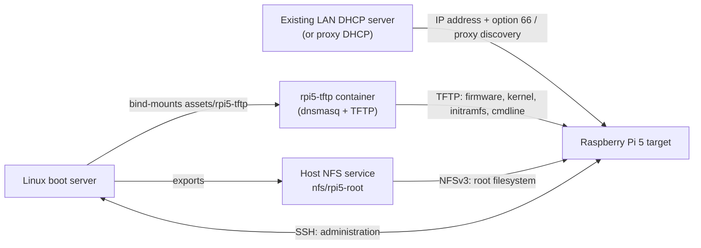

# Raspberry Pi 5 LAN Boot Workspace

This workspace prepares Raspberry Pi OS Legacy Lite 64-bit for a Raspberry Pi
5 that loads its boot files over TFTP and mounts its root filesystem over NFS.

## Architecture

The Linux boot server prepares and owns the Pi's boot and root filesystem
artifacts. `dnsmasq`, run as the `rpi5-tftp` container, advertises and serves
the TFTP boot tree. The host NFS service exports the Pi root filesystem. The
Raspberry Pi 5 is the target: it obtains network settings, loads its firmware,
kernel, and initramfs from TFTP, then mounts its operating-system root from
NFS. Once booted, it is managed from the server over SSH.



The Pi must use wired Ethernet. Keep the boot server's LAN address stable: it
is embedded in the NFS kernel command line and used for TFTP discovery.

## Folder structure

```text
.
├── README.md                         setup and operating guide
├── docker-compose.yml                TFTP/proxy-DHCP container configuration
├── config/rpi5/
│   └── cmdline.txt.template          NFS-root kernel command-line template
├── scripts/
│   ├── install-dependencies.sh       installs host prerequisites
│   ├── prepare-rpi5-lite.sh          builds the TFTP tree and NFS root
│   ├── customize-rpi-user.sh         creates the Pi user and enables SSH
│   ├── enable-overlayfs.sh           enables disposable RAM-backed Pi writes
│   └── shutdown-rpi.sh               powers down the target safely over SSH
├── assets/                           generated TFTP boot files and boot image
├── downloads/                        generated cached Raspberry Pi OS archive
├── nfs/rpi5-root/                    generated Raspberry Pi OS root, exported by NFS
└── work/                             generated temporary image and OverlayFS backups
```

`assets/`, `downloads/`, `nfs/`, and `work/` are generated locally and are not
tracked in Git. Regenerate the boot tree and NFS root with
`scripts/prepare-rpi5-lite.sh`; rerun `scripts/customize-rpi-user.sh` after
doing so.

## 1. Install the server dependencies

Run this on the Linux boot server:

```bash
./scripts/install-dependencies.sh
```

The script installs Docker, Docker Compose, NFS, OpenSSH, OpenSSL, and the image
and FAT filesystem utilities used by the preparation script. It also downloads
the container images declared in `docker-compose.yml`.

## 2. Prepare the Raspberry Pi filesystem

Find the boot server's stable LAN address:

```bash
ip route get 1.1.1.1
```

Use the address after `src` when preparing the image. On the current server:

```bash
./scripts/prepare-rpi5-lite.sh \
  --server-ip 192.168.8.186 \
  --root-export /home/zijian/repositories/pex/nfs/rpi5-root
```

Use `--no-download` on later runs to require the previously downloaded image:

```bash
./scripts/prepare-rpi5-lite.sh \
  --server-ip 192.168.8.186 \
  --root-export /home/zijian/repositories/pex/nfs/rpi5-root \
  --no-download
```

This creates:

```text
assets/rpi5-tftp/        boot files served over TFTP
assets/rpi5-boot.img     optional compact FAT boot image
nfs/rpi5-root/           root filesystem exported over NFS
```

Verify that the generated kernel command line uses NFS:

```bash
cat assets/rpi5-tftp/cmdline.txt
```

It should contain:

```text
root=/dev/nfs nfsroot=192.168.8.186:/home/zijian/repositories/pex/nfs/rpi5-root,vers=3,tcp,nolock rw ip=dhcp rootwait
```

If it contains `root=PARTUUID=...`, the preparation script was run without
`--server-ip`. Run it again with both `--server-ip` and `--root-export`.

The TFTP tree and NFS root directory should be owned by `root`. Files inside
the NFS root deliberately retain the numeric owners from Raspberry Pi OS; not
every file should have owner `root`. If a previous preparation made the whole
tree belong to the host user, rerun this step to extract it with correct
ownership before applying account or OverlayFS customization.

## 3. Create the Pi account and enable SSH

Run this after preparing the filesystem:

```bash
./scripts/customize-rpi-user.sh --username zijian
```

The script prompts for a password without displaying it, stores only a salted
password hash, enables SSH, and confirms that OpenSSH Server exists in the Pi
root. Rerun this step whenever the preparation script is rerun, because image
preparation replaces the boot and root filesystem trees.

## 4. Export the NFS root

```bash
sudo tee /etc/exports.d/pex.exports >/dev/null <<'EOF'
/home/zijian/repositories/pex/nfs/rpi5-root *(rw,sync,no_subtree_check,no_root_squash)
EOF

sudo exportfs -rav
sudo systemctl enable --now rpcbind nfs-kernel-server
sudo exportfs -v
```

The exported path must exactly match the path after the server address in
`nfsroot=`.

## 5. Configure TFTP discovery

Find the wired interface name:

```bash
ip -br link
ip -4 address
```

Set the matching interface in `docker-compose.yml`. The current configuration
uses `eth0`:

```yaml
- --interface=eth0
```

The Pi bootloader must also learn the TFTP server address through DHCP. Either
set DHCP option 66 on the router to `192.168.8.186`, or add proxy-DHCP settings
to the `rpi5-tftp` command in `docker-compose.yml`:

```yaml
- --log-dhcp
- --dhcp-range=192.168.8.255,proxy
- --pxe-service=0,"Raspberry Pi Boot"
```

The example broadcast address assumes the LAN is `192.168.8.0/24`. Do not add
a second normal DHCP server when the router already provides DHCP.

Start TFTP and watch its logs:

```bash
docker compose up -d rpi5-tftp
docker compose ps
docker compose logs -f rpi5-tftp
```

Allow DHCP/BOOTP, TFTP, RPC, NFS, and NFSv3 helper traffic through any server
firewall. The main ports are UDP 67-69 and TCP/UDP 111 and 2049.

## 6. Enable network boot on the Pi 5

Boot the Pi once from a normal Raspberry Pi OS SD card, update it, and select
network boot in the boot-order menu:

```bash
sudo apt update
sudo apt full-upgrade -y
sudo raspi-config
```

Alternatively, edit the EEPROM configuration:

```bash
sudo -E rpi-eeprom-config --edit
```

Use this order to try SD first, then network, and repeat:

```text
BOOT_ORDER=0xf21
```

Reboot once to apply the EEPROM update, then power off and remove the SD card.

## 7. Boot and connect

Connect the Pi through wired Ethernet, power it on, and watch the TFTP logs on
the server. Reserve the Pi's Ethernet MAC address in the router's DHCP settings
if it should always receive the same address.

After it boots, verify its address locally with:

```bash
hostname -I
ip -4 address
ip route
```

Then connect from the server:

```bash
ping <pi-ip-address>
ssh zijian@<pi-ip-address>
```

Shut the Pi down cleanly from the server before removing power:

```bash
./scripts/shutdown-rpi.sh --pi-host zijian@<pi-ip-address>
```

The complete boot path is:

```text
Pi EEPROM -> DHCP/TFTP discovery -> TFTP boot files -> kernel -> NFS root -> SSH
```

## Optional: make the Pi root ephemeral with OverlayFS

After confirming that the Pi boots and is reachable over SSH, run this on the
boot server:

```bash
./scripts/enable-overlayfs.sh --pi-host zijian@<pi-ip-address>
```

The command installs an NFS-aware initramfs on the Pi, remounts the NFS root as
a read-only lower layer during future boots, and uses a RAM-backed writable
upper layer. It synchronizes the new initramfs and boot configuration to TFTP
and backs up the previous boot configuration under `work/overlayfs-backups/`.

Reboot the Pi and verify that `/` uses OverlayFS:

```bash
sudo reboot
findmnt -t overlay /
```

Files written after OverlayFS starts, including package and configuration
changes, disappear at the next reboot. Make permanent changes to the base NFS
root only while OverlayFS is disabled or from the server while the Pi is off.

## Notes

- Give the boot server a static address or a DHCP reservation. If its address
  changes, both `cmdline.txt` and the DHCP/TFTP discovery configuration become
  invalid.
- Raspberry Pi 5 requires a non-empty `config.txt` in the boot filesystem.
- `boot.img` is optional. The preparation script creates it only when the boot
  tree fits within the Raspberry Pi bootloader's 96 MiB limit.
- Every Pi sharing `nfs/rpi5-root/` shares the same writable filesystem and
  account state. Use a separate NFS root for each independently managed Pi.
